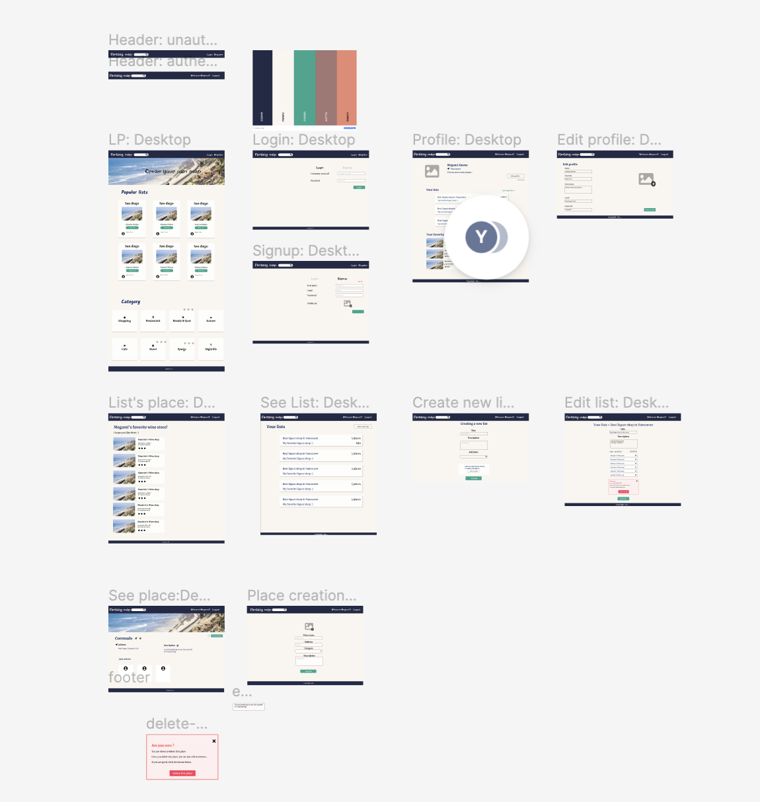
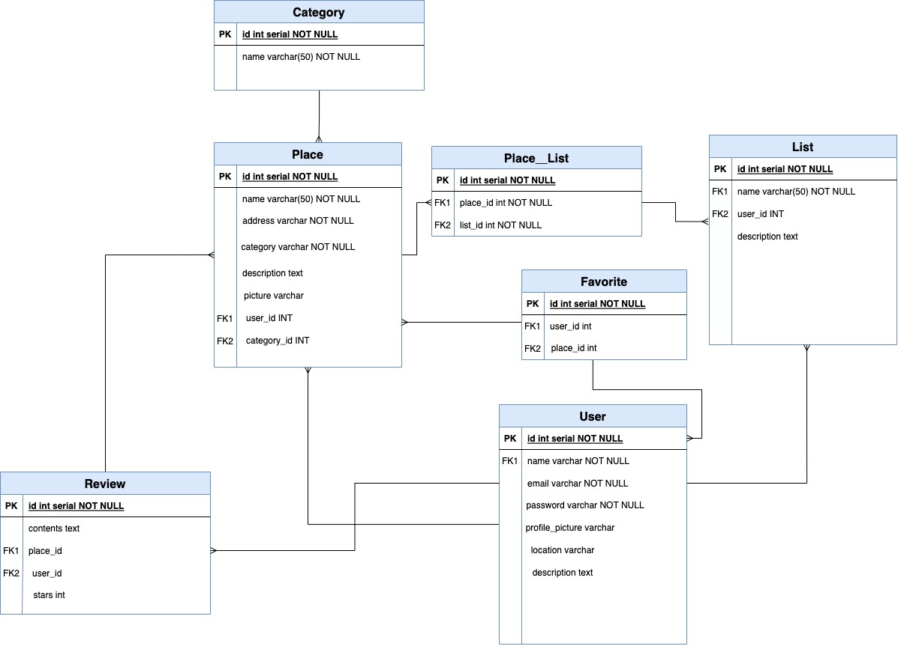

# About

 

This is Yelp like application for school project not for release or monetize.

Users can share their own list of places where they enjoy their life.
They also check the location and direction.

# Why we cerated this app

We created this app to show what we learned through our class such as React.js, Typescript for frontend, Node.js for Backend and Postgres for Database.

# Language and Libraries

- React.js
- TypeScript
- Material UI
- Framer Motion(Animation)
- Node.js/express
- PostgresSQL
- Sequelize
- Heroku
- Supabase(Image storing and database hosting)

React.js is a JavaScript library, the most popular one nowadays. It's used for building interactive user interfaces and web applications efficiently.

We use Material UI for styling because it provides us a pre-built UI component make us able to finish design quickly.

For a server-side, we use Node.js that allows us to use JavaScript which we use for frontend as well.
We especially work with Express.js framework.

For storing our data, we use PostgresSQL which we mainly obtained from the class.

We deploy both client-side and server-side on the Heroku.
They are deployed on the same server.

# UI design

I created UI design Figma.
Since we want to focus on function-wise, I tried to make it simple but cared User experience.

# ERD

This is an ERD of our application represents our data structure.
We have seven tables.

- Place
- Place_List (Place register in the list)
- List
- Category of the list
- Favorite
- User
- Review
